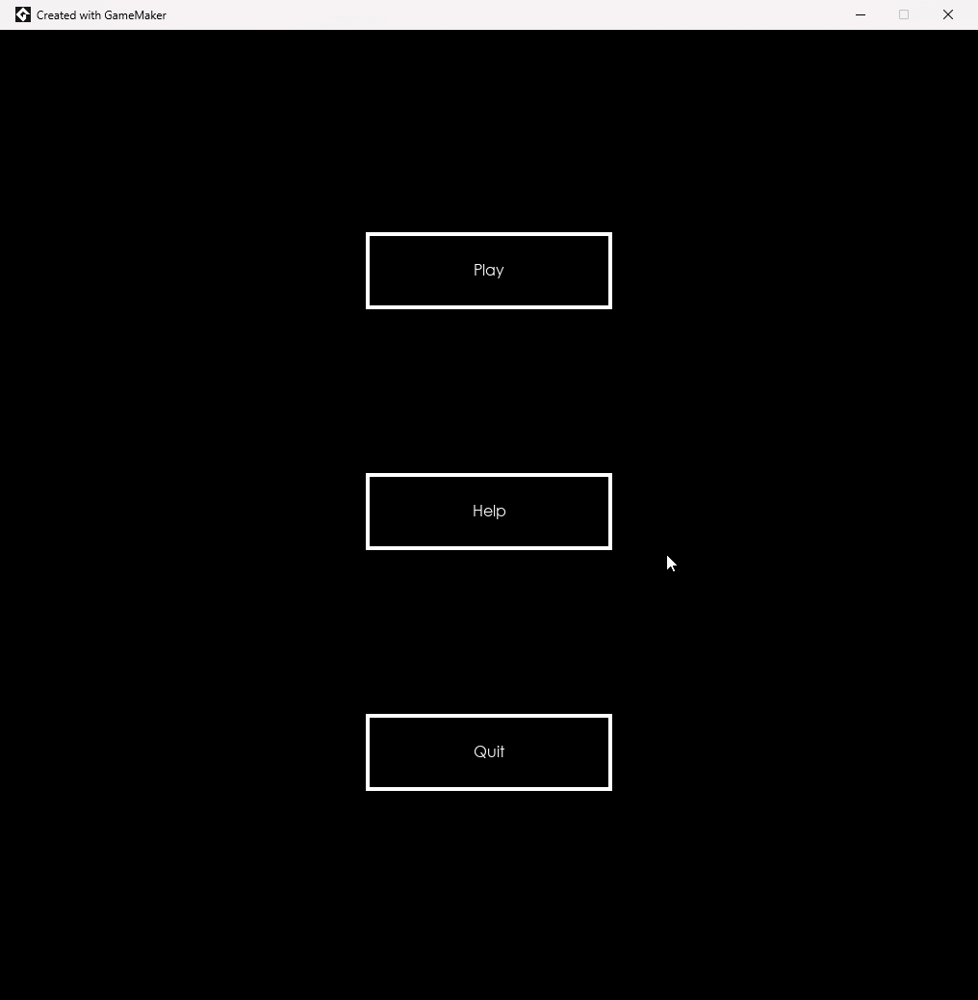
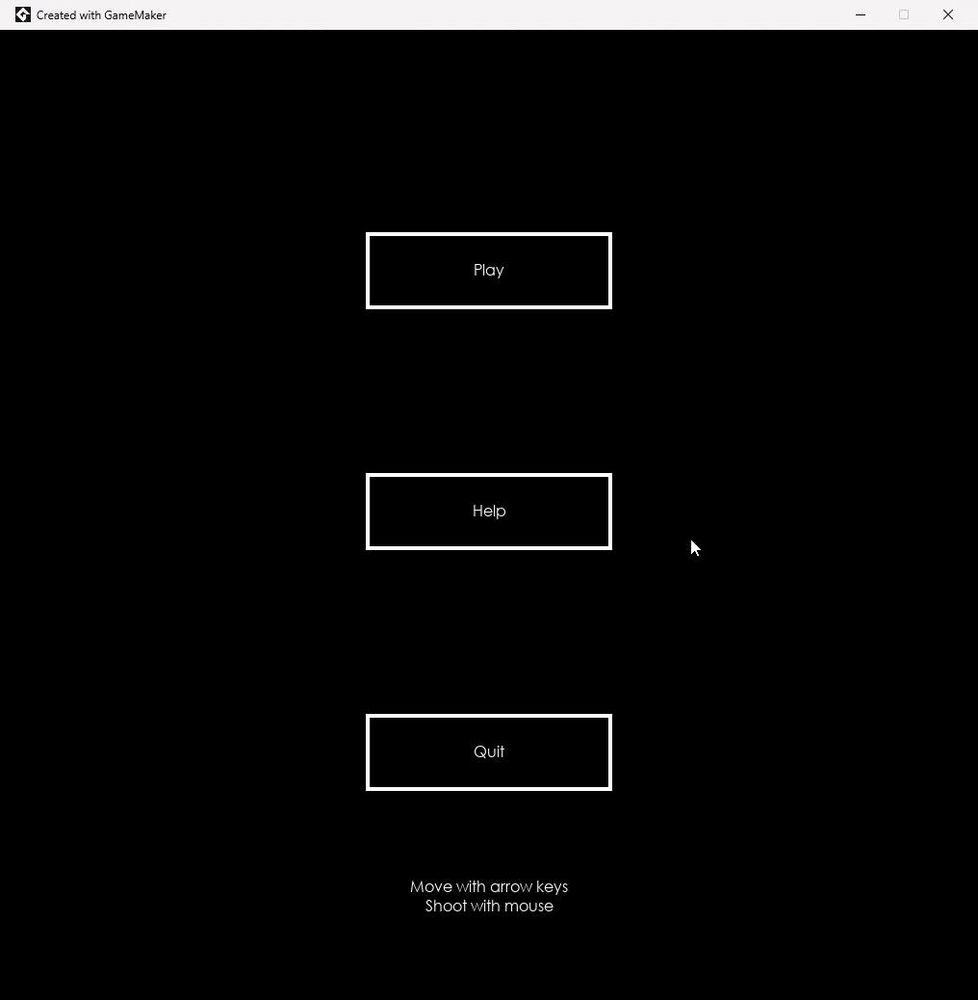

# Space Rocks

 
This project is intended to be run in GameMaker Studio. It is the result of following the tutorials for "Space Rocks" for a beginner to learn the tools.

You can find a link to the tutorial here: https://gamemaker.io/en/tutorials/make-arcade-space-shooter

This is in no way my own original creation and is intended to be the first step in learning how to use GameMaker to make projects of my own, but I want to save my progress remotely here. The only thing I've added myself is comments explaining the Game Maker Language (GML) code.
